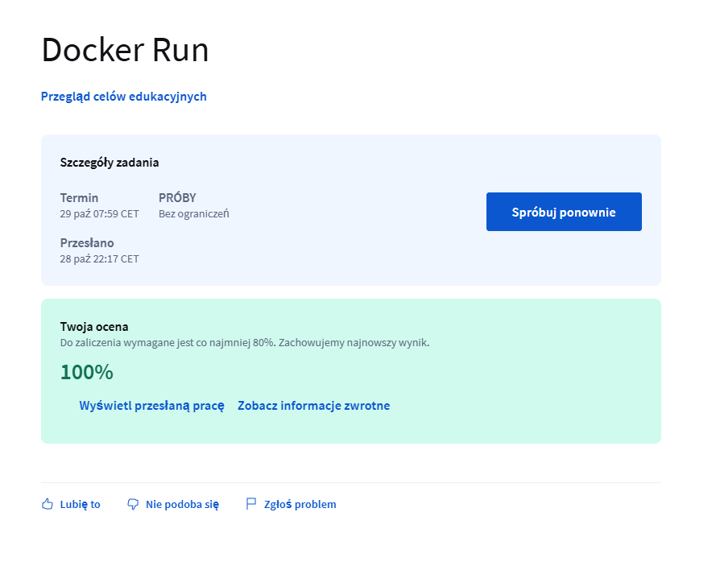
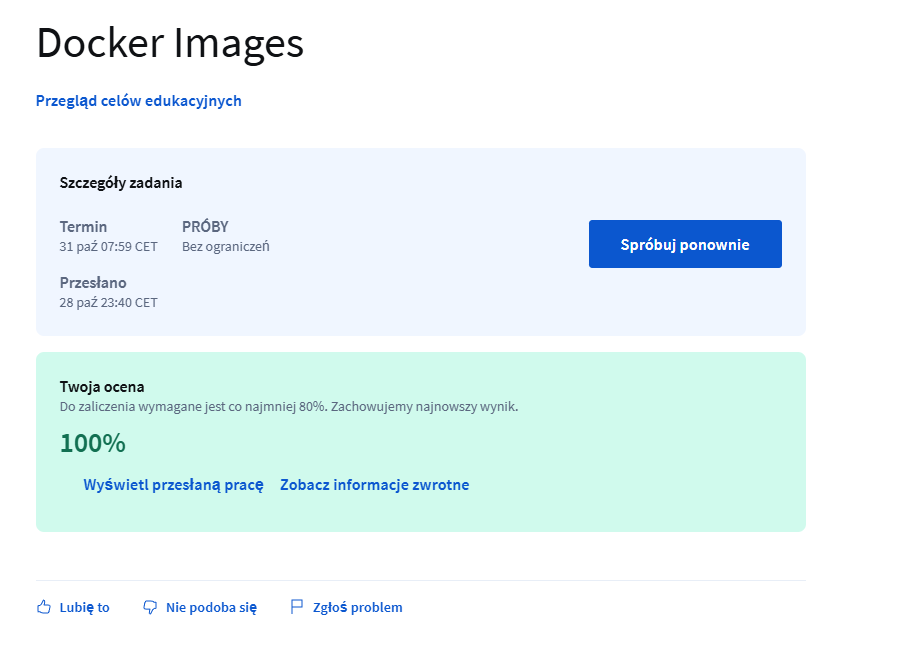
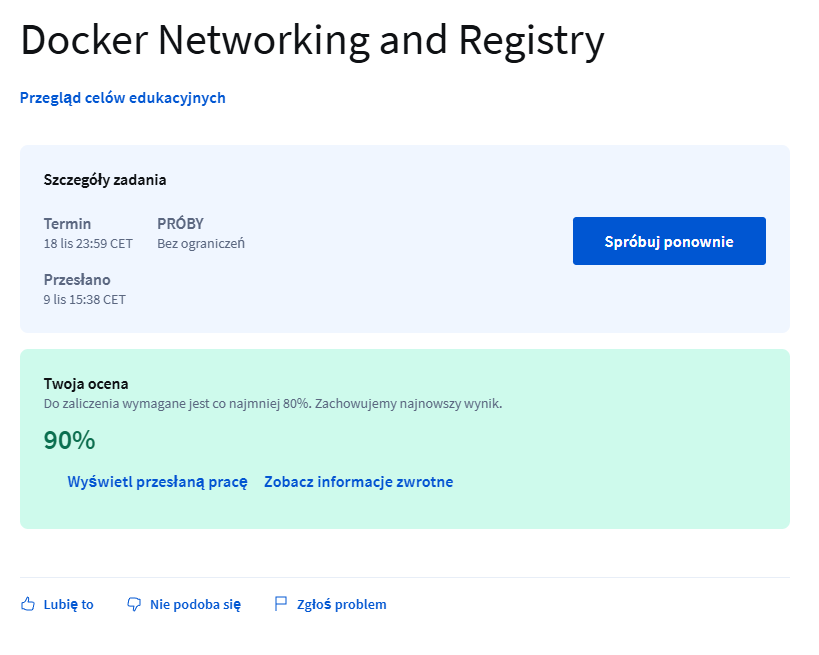
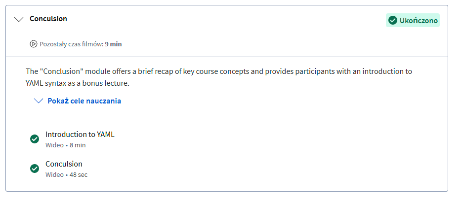
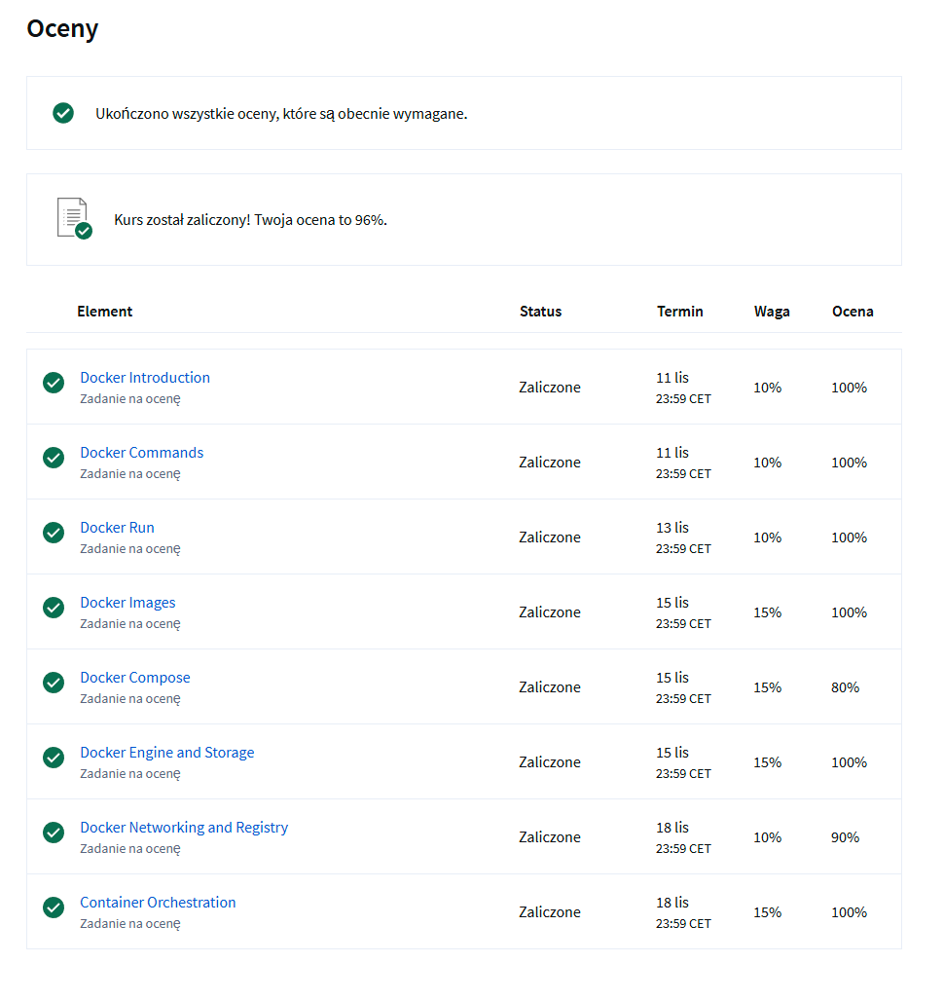

### Lab1 Michał Ławryk

## 1.RUNNING CONTAINERS

Screenshot z modułu 1: 

Screenshot z modułu 2:  

Screenshot z modułu 3:  

Screenshot z modułu 4:  

Screenshot z modułu 5:  

Screenshot z modułu 6:  

Screenshot z modułu 7:  

Screenshot z modułu 8:  

Screenshot z modułu 9:  

Screenshot z modułu 10:  

Screenshot z podsumowania:  

