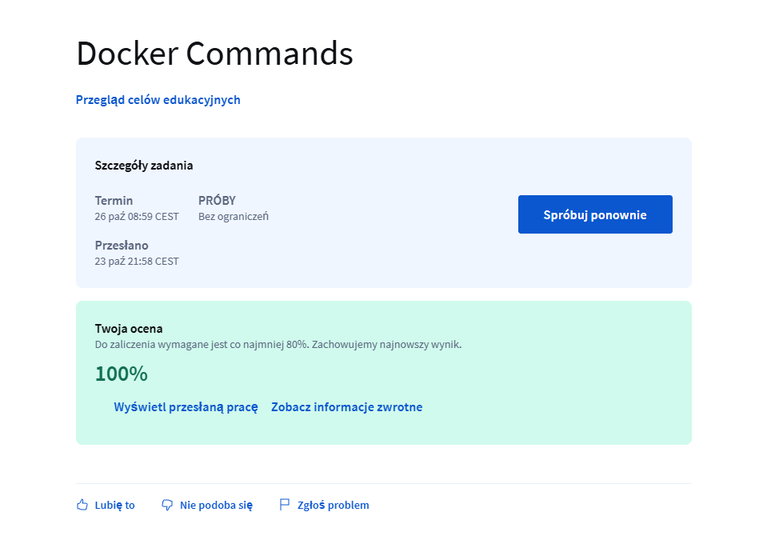
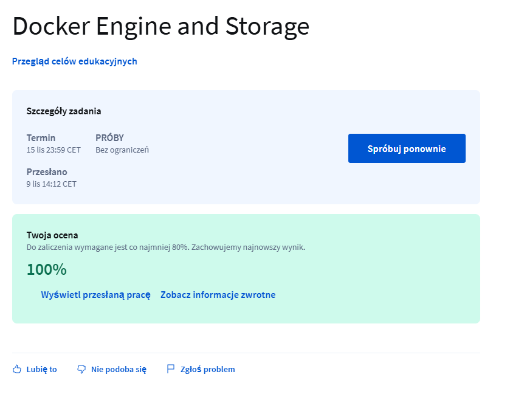

### Docker for beginners

Screenshot of the lecture 1:

Screenshot of the lecture 2:

Screenshot of the lecture 3:

Screenshot of the lecture 4:

Screenshot of the lecture 5:

Screenshot of the lecture 6:

Screenshot of the lecture 7:

Screenshot of the lecture 8:

Screenshot of the lecture 9:

Screenshot of the lecture 10:
