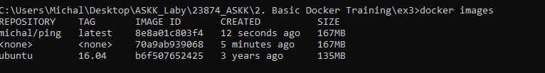

### Lab2 Michał Ławryk

### 1.BASIC DOCKER TRAINING

## Zadanie 1: Running Containers

  
Komenda `docker image`   

  
Komenda `docker search <ubuntu>`   

  
Komenda `docker pull ubuntu:22.04`   

  
Komenda `docker pull ubuntu:22.10`   

  
Komenda `docker images`   

  
Komenda `docker rmi <692eb4a905c0>`   

  
Komenda `docker images`   

  
Komenda `docker rmi $(docker images -q)`   

  
Komenda `docker run ubuntu:22.04 /bin/echo 'Hello world!'`   

  
Komenda `docker ps`   

  
Komenda `docker ps -a`   

  
Komenda `docker run ubuntu:22.04 /bin/bash`   

  
Komenda `docker ps -a`   

  
Komenda `docker run -it ubuntu:22.04 /bin/bash`   

  
Komenda wyświetlająca katalogi systemowe   

  
Komenda `/bin/sleep 3600`   

  
Komenda `docker ps`   

  
Komenda `docker exec -it d36 /bin/bash`   

  
Komenda `ps aux`   

  
Komenda `exit`   

  
Komenda `docker stop d368`   

  
Komenda `docker ps -a`   

  
Komenda `docker ps -a`   

## Zadanie 2: Changing Images

  
Komenda `docker pull ubuntu:16.04`   

  
Komenda `docker run -it ubuntu:16.04 /bin/bash`   

  
Komenda `ping google.com`   

  
Komenda `apt-get update`   

  
Komenda `apt-get install iputils-ping`   

  
Komenda `ping google.com`   

  
Komenda `docker ps -a`   

  
Komenda `docker commit --help`   

  
Komenda `docker commit -a "Michal Lawryk" -m "Added ping utility." ce5 <DockerHub username>/ping`   

  
Komenda `docker images`   

  
Komenda `docker run -it --rm <DockerHub username>/ping /bin/bash`   

## Zadanie 3: Building Images

  
Komenda `docker pull ubuntu:16.04`   

  
Komenda `docker images`   

  
Tworzenie pliku Dockerfile   

  
Komenda `docker build -t michal/ping .`   

  
Komenda `docker build -t michal/ping .`   

  
Komenda `docker images`   

  
Optymalizacja pliku Dockerfile   

  
Komenda `docker images`   

  
Kolejna optymalizacja Dockerfile   

  
Komenda `docker images`  
Obraz jest lżejszy od pierwotnego o 28MB   

  
Dodanie polecenia ping po uruchomieniu kontenera   

  
Komenda `docker run -it michal/ping`   

## Zadanie 4: Sharing Images

  
Komenda `docker login`   

  
Komenda `docker search kafka`   

  
Komenda `docker tag michal/ping <DockerHub username>/ping:1.0`   

  
Komenda `docker push <DockerHub username>/ping:1.0`   

## Zadanie 5: Volumes

  
  
Uruchomienie apache   

  
Podmienienie pliku strony internetowej serwera apache   

  
Zawartość strony wyświetlanej przez serwer   

  
Serwer nie pamięta zmian po ponownym uruchomieniu kontenera. Należy skorzystać z wolumenu   

  
Operacje tworzenia i usuwania wolumenów   

  
Instalacja stworzonego wolumenu do serwera apache   

  
Przesłanie pliku html do katalogu serwerowego, gdzie został zainstalowany wolumen   

  
Nawet po ponownym uruchomieniu kontenera, zmiany zostają zachowane za sprawą wolumenu. Na koniec pracy zatrzymuje serwer apache i usuwam wolumen.   

  
Istnieję również możliwość bezpośredniego podłączenia lokalnego katalogu do kontenera serwerowego, pomojając konieczność tworzenia wolumenu. Na powyższym screenie przedstawione zostało jak tego dokonać. Jak widać później, plik html z katalogu lokalnego został wczytany do serwera apache.   

## Zadanie 6: Networking

  
Komenda `docker network ls`   

  
Komenda `docker network inspect bridge`   

  
Komenda `docker run --rm -d --name dummy michal/ping`   

  
Komenda `docker network inspect bridge`  
Dummy został dodany do domyślnej sieci   

  
Komenda `docker run --rm -d -d PING_TARGET=172.17.0.2 --name pinger michal/ping`  
Następnie wyświetlenie logów uruchomionego kontenera `docker logs pinger`  
Jak widać pinger poprawnie pinguje kontener o podanym adresie IP   

  
Komenda `docker run --rm -d -d PING_TARGET=dummy --name pinger michal/ping`  
Nie rozpoznano nazwy kontenera co spowodowało przerwanie działania pingera   

  
Komenda `docker network create skynet`  
Utworzono sieć "skynet"   

  
Zatrzymanie działających kontenerów, następnie uruchomienie dummy i pingera jak poprzednio, tyle że przypisano te kontenery do sieci skynet  
Jak widać po logach, pinger działa poprawnie po wprowadzeniu jako cel nazwę hosta   

  

  
Postępując zgodnie z instrukcjami autora, nie udało się uruchomić kontenera postgres
