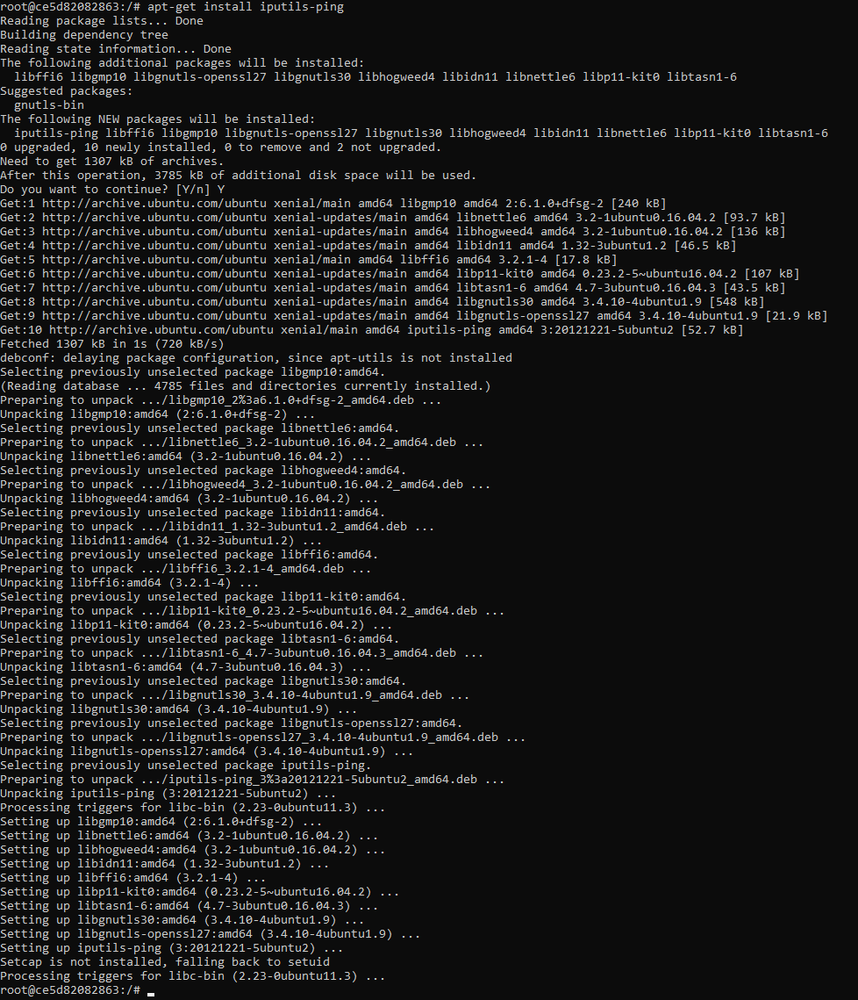

### Lab2 Michał Ławryk

### 1.BASIC DOCKER TRAINING

## Zadanie 1:
#### Running Containers

  
Komenda `docker image`  

  
Komenda `docker search <ubuntu>`  

  
Komenda `docker pull ubuntu:22.04`  

  
Komenda `docker pull ubuntu:22.10`  

  
Komenda `docker images`  

  
Komenda `docker rmi <692eb4a905c0>`  

  
Komenda `docker images`  

  
Komenda `docker rmi $(docker images -q)`  

  
Komenda `docker run ubuntu:22.04 /bin/echo 'Hello world!'`  

  
Komenda `docker ps`  

  
Komenda `docker ps -a`  

  
Komenda `docker run ubuntu:22.04 /bin/bash`  

  
Komenda `docker ps -a`  

  
Komenda `docker run -it ubuntu:22.04 /bin/bash`  

  
Komenda wyświetlająca katalogi systemowe  

  
Komenda `/bin/sleep 3600`  

  
Komenda `docker ps`  

  
Komenda `docker exec -it d36 /bin/bash`  

  
Komenda `ps aux`  

  
Komenda `exit`  

  
Komenda `docker stop d368`  

  
Komenda `docker ps -a`  

  
Komenda `docker ps -a`  

## Zadanie 2:
#### Changing Images

Komenda `docker pull ubuntu:16.04`

Komenda `docker run -it ubuntu:16.04 /bin/bash`

Komenda `ping google.com`

Komenda `apt-get update`

Komenda `apt-get install iputils-ping`

Komenda `ping google.com`

Komenda `docker ps -a`

Komenda `docker commit --help`

Komenda `docker commit -a "Michal Lawryk" -m "Added ping utility." ce5 <DockerHub username>/ping`

Komenda `docker images`

Komenda `docker run -it --rm <DockerHub username>/ping /bin/bash`

## Zadanie 3:
#### Building Images

Komenda `docker pull ubuntu:16.04`

Komenda `docker images`

Tworzenie pliku Dockerfile

Komenda `docker build -t michal/ping .`

Komenda `docker build -t michal/ping .`

Komenda `docker images`

Optymalizacja pliku Dockerfile

Komenda `docker images`

Kolejna optymalizacja Dockerfile

Komenda `docker images`

Obraz jest lżejszy od pierwotnego o 28MB

Dodanie polecenia ping po uruchomieniu kontenera

Komenda `docker run -it michal/ping`

## Zadanie 4:
#### Sharing Images

Komenda `docker login`

Komenda `docker search kafka`

Komenda `docker tag michal/ping <DockerHub username>/ping:1.0`

Komenda `docker push <DockerHub username>/ping:1.0`

## Zadanie 5:
#### Volumes

Uruchomienie apache

Podmienienie pliku strony internetowej serwera apache

Zawartość strony wyświetlanej przez serwer

Serwer nie pamięta zmian po ponownym uruchomieniu kontenera. Należy skorzystać z wolumenu

Operacje tworzenia i usuwania wolumenów

Instalacja stworzonego wolumenu do serwera apache

Przesłanie pliku html do katalogu serwerowego, gdzie został zainstalowany wolumen

Nawet po ponownym uruchomieniu kontenera, zmiany zostają zachowane za sprawą wolumenu. Na koniec pracy zatrzymuje serwer apache i usuwam wolumen.

Istnieję również możliwość bezpośredniego podłączenia lokalnego katalogu do kontenera serwerowego, pomojając konieczność tworzenia wolumenu. Na powyższym screenie przedstawione zostało jak tego dokonać. Jak widać później, plik html z katalogu lokalnego został wczytany do serwera apache.

## Zadanie 6:
#### Networking

