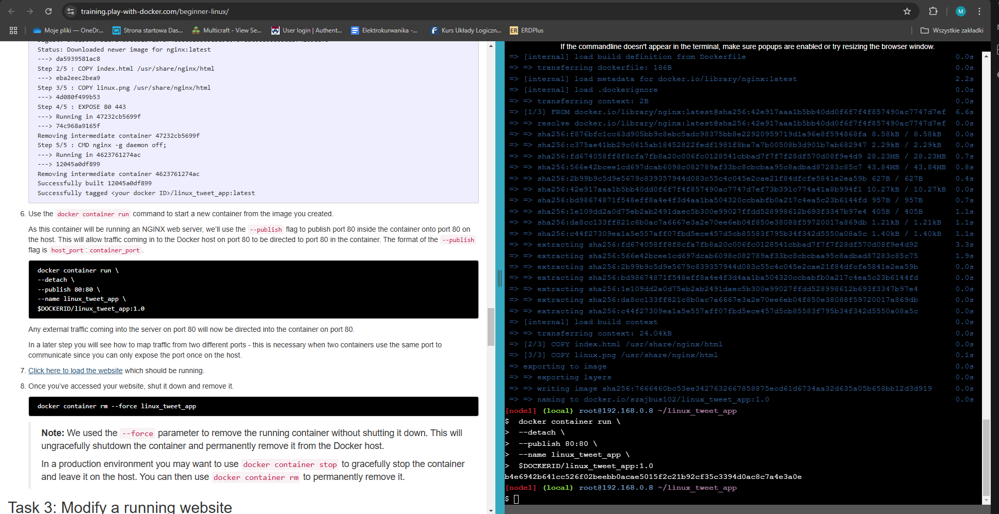
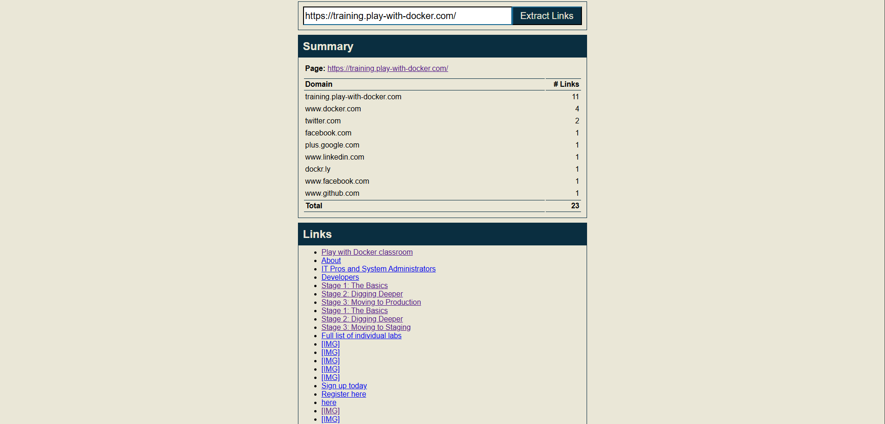
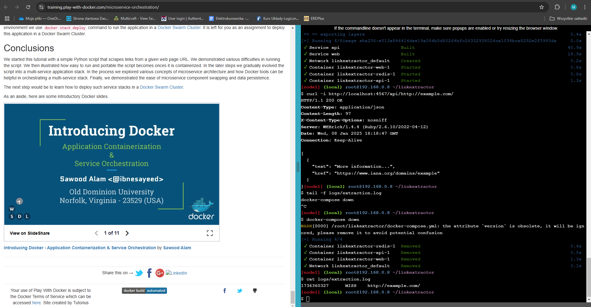

### Lab3 Michał Ławryk

### 3. Play with Docker trainings (Developvers)

Wybrałem zadania ze ścieżki Getting Started Walk-treough for Developers.

W sekcji 1 znajdują się pierwsze 3 zadania do wykonania.

## Zadanie 1: Docker for Beginners

Ogólnie podstawowe operacje na kontenerach, większość treści była mi znana.

  
Uruchomienie projektu Linux Tweet App   

  
Podkgąd strony internetowej   

  
Kolor tła strony zmieniony na pomarańczowy   

  
Modyfikacja strony internetowej, obrazu, testowanie nowej wersji i przesyłanie wyniku na Docker Hub

## Zadanie 2: Application Containerization and Microservice Orchestration

Tutaj bardziej się skupiono na Docker Compose, tworzeniu spójnego mikroserwisu wyciągającego wszystkie linki z podanej strony internetowej.

Wszystko zostało w przystępny sposób objaśnione i postępując krok po kroku przedstawiam wyniki pracy tego laboratorium

  
Proces tworzenia i konteneryzacji serwisu   

  
Widok gotowej aplikacji   

  
Wynik po wprowadzeniu adresu `https://training.play-with-docker.com/`   

  
Modyfikacja tekstu w stopce   

  
Wyłączanie serwisu   

  
Zmiana API Pythona na Ruby i testowanie

## Zadanie 3: Deploying a Multi-Service App in Docker Swarm Mode

Tematem tego zadania jest nauka tworzenia multiserwisowej aplikacji używając docker compose.

  
Inicjalizacja roju (swarm)  

  
Na zdjęciu powyżej widać bład przy próbie uruchomienia tego mutliserwisu, niestety w materiałach dydaktycznych muszą być jakieś błędy skryptu uniemożlwiające realizację tego ćwiczenia. Jednakże mimo to, zagłębiając się do poszczególnych podrozdziałów, znalazłem wiele ciekawych i wcześniej nieznanych komend wartych uwagi.

### Sekcja 2

W tej sekcji głównym założeniem jest ukazanie w jaki sposób można posługiwać się dokerem podczas całego procesu pracy programisty.

Znajdują się tam odnośniki do poradników, gdzie na podstawie przykładowego projektu springowego skolnowanego z githuba uruchamiany jest z poziomu IDE (tu do wyboru Eclipse, IntelliJ i Netbeans). Niestety ani w Eclipse ani w IntelliJ nie udało mi się uruchomić tego projektu. W przypadku Eclipse nieustanie pojawia się błąd kompilacji co widać poniżej.
   

Odnośnie IntelliJ, tutorial jest nieaktualny ponieważ to IDE otrzymało bardzo wiele zmian i próbując nawet swoich sił w samodzielnym przygotowaniu tego projektu, niewiele się udało wykonać.

Ta sekcja bardzo mnie zainteresowała, jednak niestety każdy tutorial odnośi się do przestarzałych wersji różnych IDE przez co stwarza to ogromne trudności z wykonaniem tego zadania.

### Sekcja 3

Sekcja 3 a zarazem ostatnia dla ścieżki Developers składa się z samych filmów udostępnionych na YouTube. Są nimi: 
-Docker for .NET Developers 
-Docker for Java Developers 
-Building a Secure Docker Application 
-Automation and Collaboration Across Multiple Swarms Using Docker Cloud  

W ramach zajęć laboratoryjnych zapoznałem się z tymi materiałami.