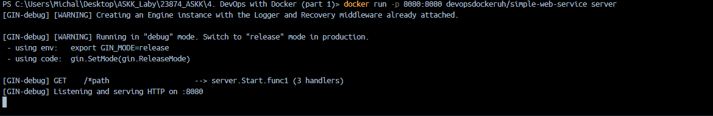

### Lab4 Michał Ławryk

### 4. DevOps with Docker (part 1)

## Zadanie 1.1

  
Podgląd 3 kontenerów, z których 2 są zatrzymane   

## Zadanie 1.2

  
Dostępne kontenery   

  
Lista kontenerów i obrazów po usunięciu   

## Zadanie 1.3

  
Uruchomienie kontenera z podanym obrazem. Co 10s wyświetla sekretnę wiadomość którą jest link   

  
Po wprowadzenia adresu przeniosło mnie do GitHuba `docker-hy`   

## Zadanie 1.4

  
Uruchomienie kontenera ubuntu  

  
Proces aktualizacji apt   

  
Wporwadzenie podanej komendy i wyświetloenie zawartości strony `helsinki.fi`  

## Zadanie 1.5

  
Porównanie rozmiarów obrazu simple-web-service. Jak widać wersja na Linuxie Alpine jest znacznie lżejsza od drugiej na Ubuntu.  

  
Dla sprawdzenia, wersja na Alpine działa tak samo.  

## Zadanie 1.6

  
Uruchomienie podanego obrazu na kontenerze. Należało jako input podać sekretne hasło ktore udało mi się znaleźć.   

  
Hasło do obrazu znajdujące się w overview na DockerHub.   

## Zadanie 1.7

  
Uruchomienie obrazu na podstawie Dockerfile, kontener uruchamia script.sh. Wszystkie pliki zawarte są w folderze `ex1.7`.   

## Zadanie 1.8

  
Uruchomienie obrazu `web-server`. Plik Dockerfile umieszczony w folderze ex1.8   

## Zadanie 1.9

  
Niestety z niewiadomych przyczyn nie udało mi się wykonać tego polecenia. Powyższy zrzut ekranu pokazuje komunikat   

## Zadanie 1.10

  
Komenda użyta do do przypisania portu wirtualnego w taki sposób, by dostęp do aplikacji kontenerowej był dostępny z poziomu przeglądarki lokalnej   

  
Podgląd komunikatu a konteneryzowanej aplikacji   

## Zadanie 1.11

  
Uruchomienie obrazu ze springowym projektem   

  
Potwierdzenie wykonania zadania, którym jest komunikat "success"  
Plik Dockerfile dostępny jest w folderze ex1.11   

## Zadanie 1.12-14

  
Wymienione zadania były połaczone i zależne od siebie więc przedstawiam całkowity wynik końcowy jak i pliki Dockerfile w folderze ex1.12-14 