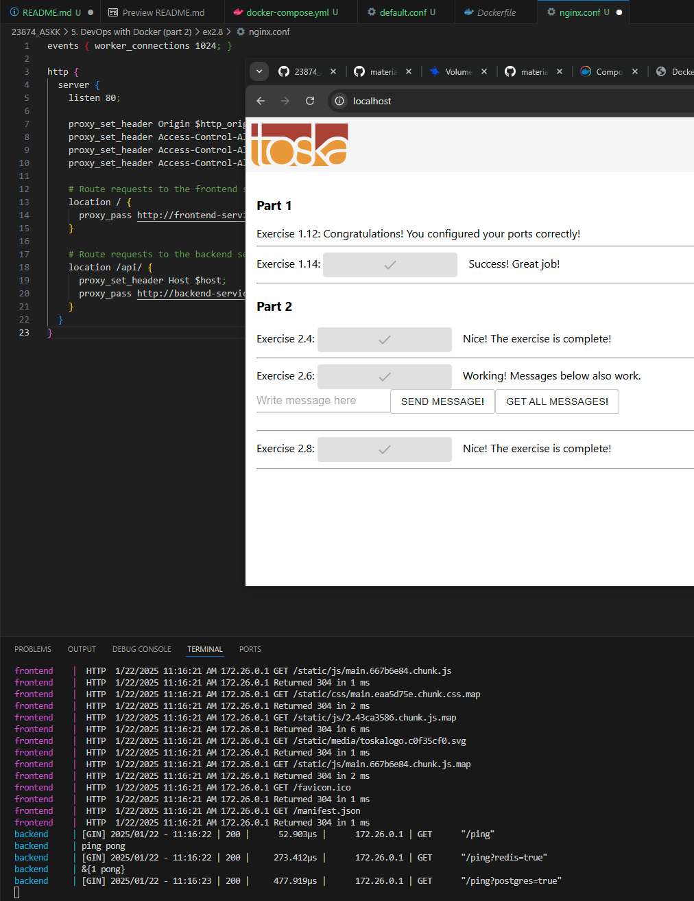
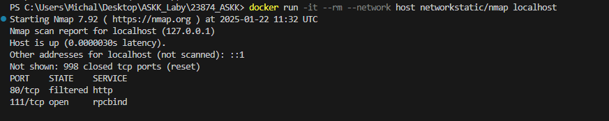

### Lab5 Michał Ławryk

### 5. DevOps with Docker (part 2)

## Zadanie 2.1

Rozwiązanie zadania w folderze ex2.1   

## Zadanie 2.2

Rozwiązanie zadania w folderze ex2.2   

## Zadanie 2.3

  
Aplikacja uruchomiona poprzez docker-compose, pliki w folderze ex2.3   

## Zadanie 2.4

  
Do docker-compose dodano kontener z Redis   

## Zadanie 2.5

  
Ćwiczenie ze skalowania serwisów. Rozwiązaniem było uruchomienie aplikacji komendą `docker-compose up --scale compute=3`   

## Zadanie 2.6

  
Dodanie kontenera z bazą danych PostgreSQL. Widać na stronie wszystkie wysłane wiadomości   

## Zadanie 2.7

Modyfikacja zadania 2.6 - podpięcie katalogu lokalnego do kontenera bazodanowego w celu przechowywania i zapisywania zebranych danych. Wystarczyło w docker-compose dodać w kontenerze bazy danych dodać `volumes: - ./database:/var/lib/postgresql/data`   

## Zadanie 2.8

  
Dodano serwis proxy w nginx   

## Zadanie 2.9

Wszystkie przyciski działają, gdyż błędy naprawiałem na bieżążco przy kolejnych zadaniach. Widać do w poprzednim zadaniu na obrazku.   

## Zadanie 2.10

  

Zamknięcie wszystkich portów nie wymagających udostępnienia, otwarty jest tylko port 80 serwera proxy 