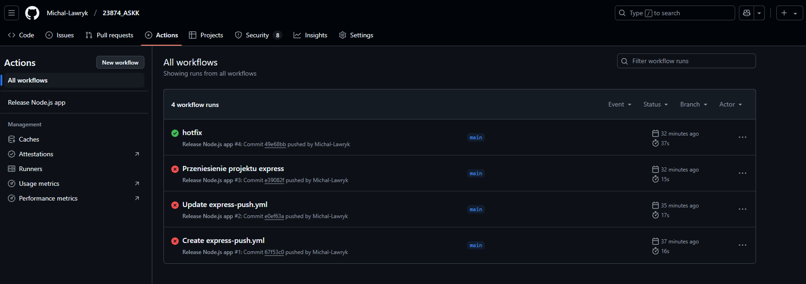
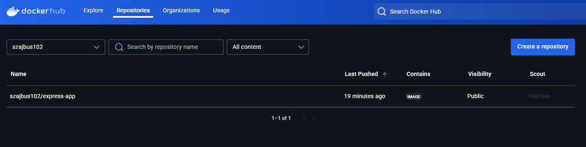
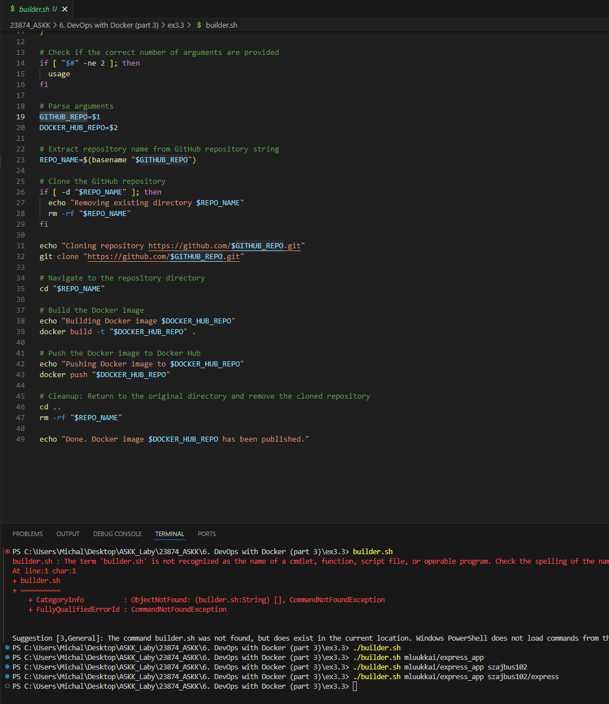
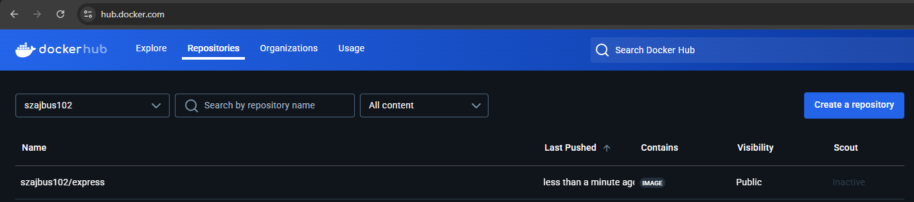
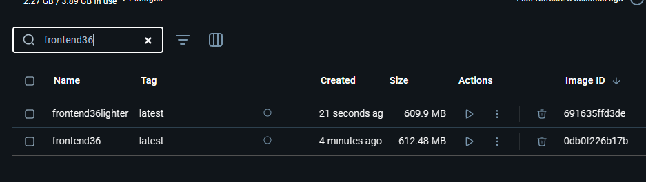
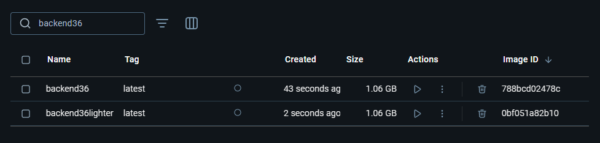
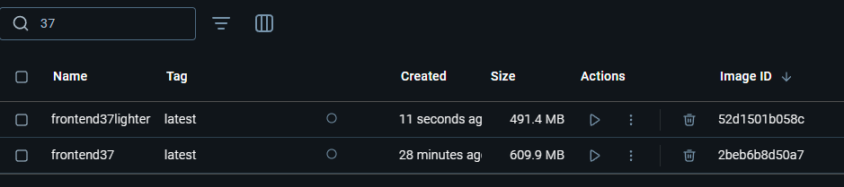
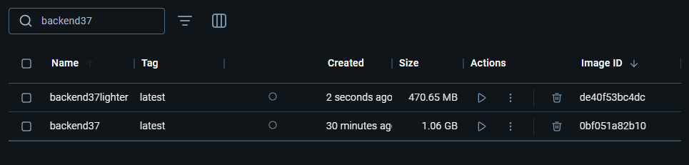
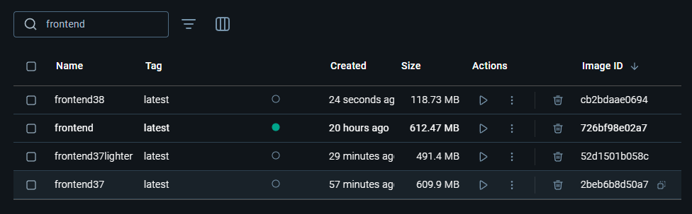
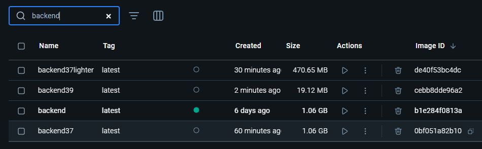

### Lab6 Michał Ławryk

### 6. DevOps with Docker (part 3)

## Zadanie 3.1

  
Działający pipeline na repozytorium   

  
Obraz wrzuzony automatycznie po pushu  
Plik .yml w folderze ex3.1   

## Zadanie 3.3

  
Uruchomienie skryptu    

  
Obraz pushnięty na Docker Hub   

## Zadanie 3.5

W tym zadaniu należało do Dockerfile backendu i frontendu wprowadzić komendy przechodzące na innego użytkownika tak żeby kontener nie był rootem. Rozwiązanie znajduje się w folderze ex3.5   

## Zadanie 3.6

  
Po zastosowani instrukcji do tego zadania, tak prezentuje się różnica w wadze obrazow frontendu   

  
A tak po stronie backendu   

## Zadanie 3.7

  
Porównanie wagi obrazów frontendu po zmianie na alpine  

  
Porównanie wagi obrazów backendu po zmianie na alpine. Tutaj dostrzec możną spore odciążenie pamięci    

## Zadanie 3.8

  
Po wprowadzeniu budowy wieloetapowej obrazu, udało mi się zejść do wagi zaledwie 119 MB dla frontendu. Przypomnę tylko, że przed wykonaniem obecnych zadań ważył on 612 MB   

## Zadanie 3.9

  
Po wprowadzeniu budowy wieloetapowej obrazu, udało mi się zejść do wagi 19 MB dla backendu. Jest to ogromny sukces biorąc pod uwagę fakt bazowej wagi tego obrazu - 1.06 GB   
